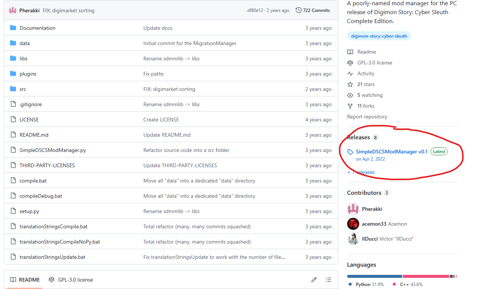
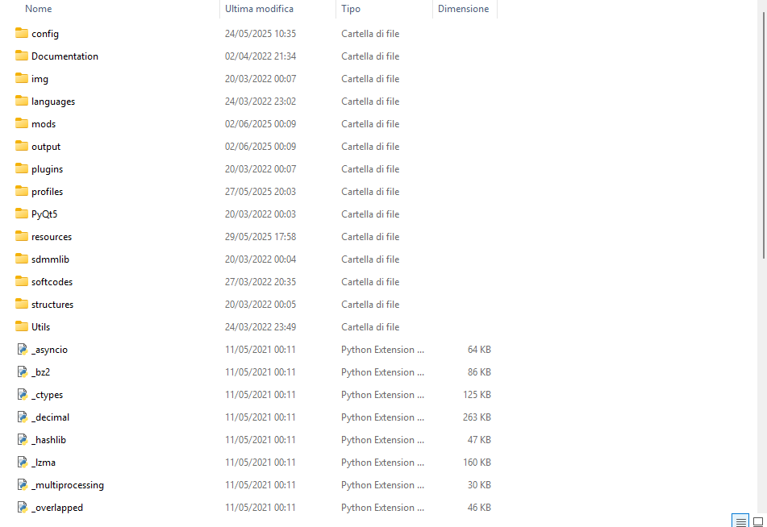
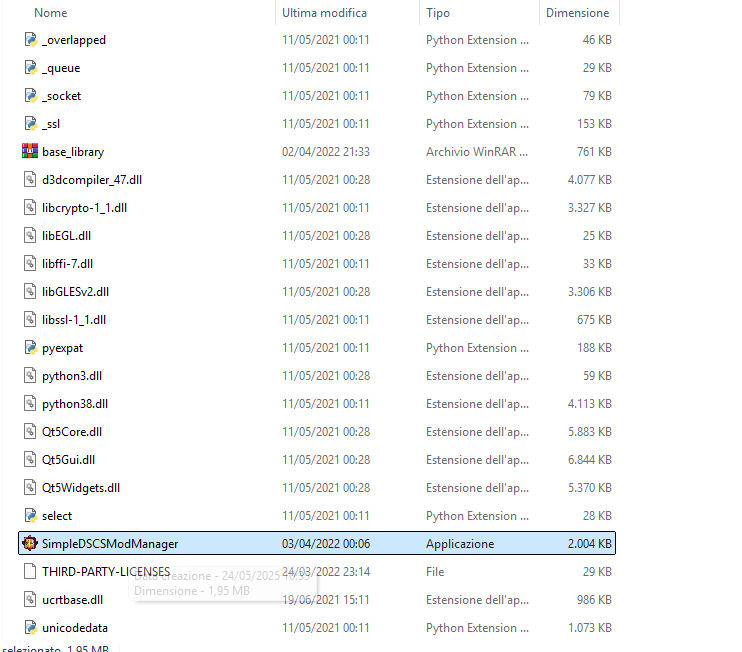
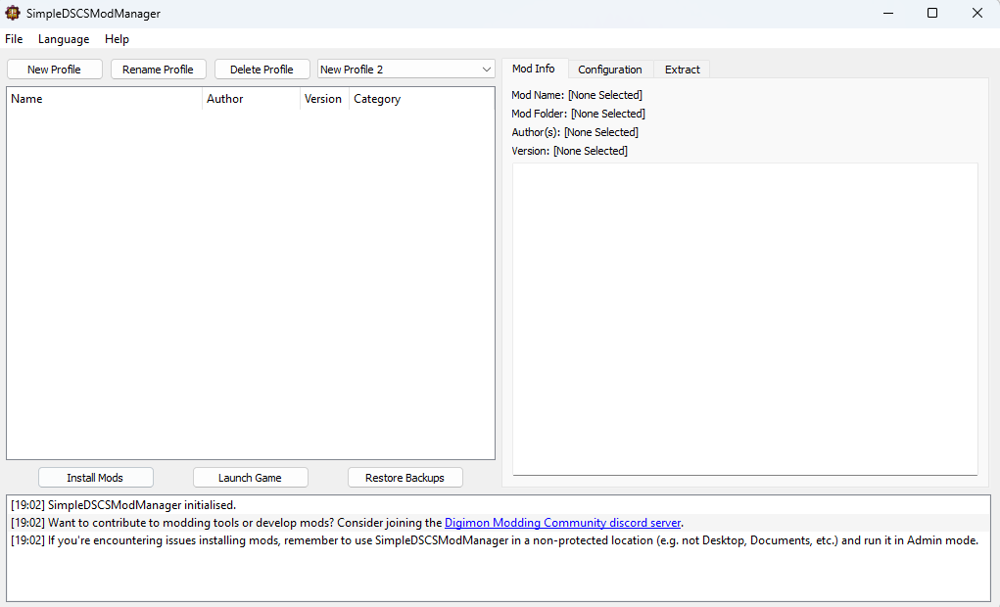
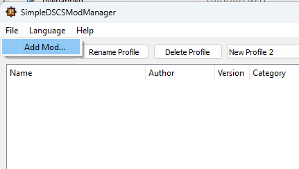
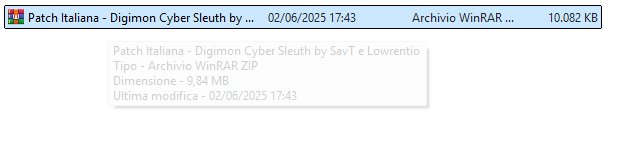
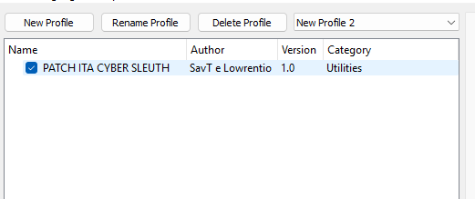
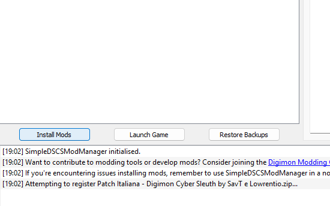
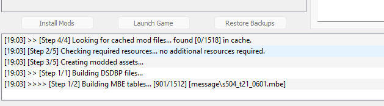
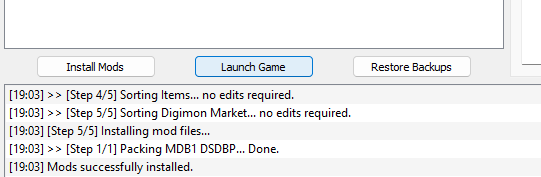

# Digimon-Story-Cyber-Sleuth-Patch-ITA 

La realizzazione della patch è stata resa possibile in larga misura grazie al contributo dell'utente "Lowrentio". Egli si è dedicato alla comprensione del funzionamento del tool per la modifica dei file di gioco e all'adattamento delle immagini.

# Come installare la patch

Per chi ha già inserito delle mod all'interno del gioco, probabilmente questo tutorial sembrerà molto scontato. Chi, invece, non lo ha mai fatto e ha cercato con questa mod l'occasione giusta per poterlo fare, di seguito vi spiegherò passo per passo come rendere in italiano il vostro gioco.

## Materiali necessari

Per prima cosa avremo bisogno di:
- La Patch italiana, nel formato .zip come lo avete scaricato.
- [SimpleDSCSModManager](https://gamebanana.com/tools/8918) ([Link Github](https://github.com/Pherakki/SimpleDSCSModManager))

### Primo passo

Scarichiamo tutto il materiale.
Per chi non sa dove andare a premere per scaricare il programma da GitHub, vi lascio l'indicazione qui di seguito:

###  Secondo passo

Estraiamo da qualche parte la cartella del programma.
Dovrebbe uscirvi una cosa del genere.

###  Terzo passo

Per proseguire, dobbiamo aprire l'eseguibile della cartella SimpleDSCSModManager, che ci aprirà il programma per caricare all'interno del gioco tutte le nostre modifiche.

###  Quarto passo

Andiamo nella locandina in alto del programma, su File, e selezioniamo "Add Mod...". Questo ci aprirà il nostro Esplora Risorse. Andiamo nel luogo del computer dove abbiamo messo la mod (nel formato .zip) e carichiamolo. Assicuriamoci che a sinistra della mod sia presente la spunta blu accesa. In caso contrario, attivarla premendoci sopra.

###  Quinto passo

Come ultimo passo, andiamo a premere "Install Mods" in basso. Inizierà un caricamento di circa 20/30 secondi. Una volta che avrà finito, uscirà scritto "Mods Successfully installed". Fatto ciò, non vi resta che andare a premere "Launch Game". In questo modo, il programma avvierà il gioco, con la mod installata.

# Immagini progetto

# Come segnalare un errore nella traduzione

Per segnalare errori nella traduzione, bisogna farlo, anche qui, tramite la mia repository su GitHub, tramite la sezione "*issue*" della repo e selezionare il template "**Errori di traduzione**". Successivamente bisogna riportare tutte le informazioni richieste per poter correggere l'errore.
Se il tuo problema è un crash del gioco, puoi creare invece l'issue dedicata al crash del gioco, seguendo sempre le linee guida riportate.

# Video dimostrativo

# Crediti e collaboratori

- Il principale autore della patch del gioco è l'utente "[Lowrentio](https://steamcommunity.com/id/Lowrentio/)".
- Lo strumento utilizzato per la codifica e decodifica dei file è "[SimpleDSCSModManager](https://gamebanana.com/tools/8918)", realizzato da [Pherakki](https://gamebanana.com/members/2101677).
