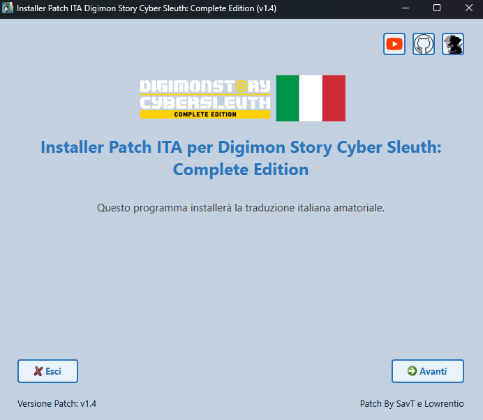
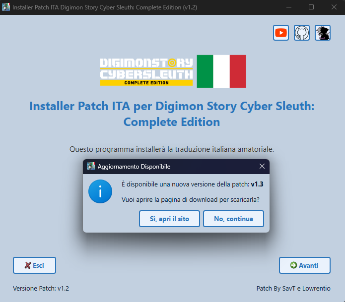

# Digimon-Story-Cyber-Sleuth-Patch-ITA [](https://www.paypal.com/paypalme/verio12)


La realizzazione della patch è stata resa possibile in larga misura grazie al contributo dell'utente "**Lowrentio**". Egli si è dedicato alla comprensione del funzionamento del tool per la modifica dei file di gioco e all'adattamento delle immagini.

# Come installare la patch

Per installare bisogna selezionare la sezione [Releases](https://github.com/zSavT/Digimon-Story-Cyber-Sleuth-Patch-ITA/releases) su GitHub e selezionare l'ultima versione della patch disponibile. Selezionate l'installer da scaricare in base al sistema operativo scelto ed avviate l'installer.



L'installazione è guidata e semplice, ma in ogni caso basterà sempre cliccare su "_Avanti_". Attendere la verifica dell'integrità dei file della Patch e cliccare successivamente su "_Avanti_".



Successivamente bisogna accettare i termini d'uso e poi nella schermata successiva, selezionare la cartella dove è installato il gioco (Di default è impostato il percorso classico) e cliccare su "_Installa Patch_".


# Funzionamento installer (Per chi vuole auto generarsi l'installer)

Per poter creare correttamente l'installer bisogna prima di tutto utilizzare ```packager.py``` per poter generare il file criptato della cartella dove sono presenti tutti i file patchati (Bisogno comunque prima fare un passaggio con il programma "[SimpleDSCSModManager](https://gamebanana.com/tools/8918)"). Lo script è guidato e bisogna solo indicare il percorso della cartella con le modifiche della Patch ed il nome del file pkg criptato. Nel file "chiave.txt" bisogna inserire la chiave di criptazione scelta.

## Creazione dell'eseguibile

Per poter generare l'eseguibile dello script bisogna utilizzare la libreria "__pyinstaller__" e generare l'eseguibile con i comandi in base al sistema operativo di arrivo.

### Windows

Per generare l'eseguibile dell'installer per Windows, bisogna utilizzare il seguente comando:
```ps
pyinstaller --onefile --windowed --hidden-import=webbrowser --hidden-import=pyzipper --hidden-import=sys --hidden-import=os --hidden-import=platform --hidden-import=traceback --hidden-import=PyQt6 --icon=assets/logo.png --add-data "assets:assets" --add-data "patch.pkg:." --add-data "chiave.txt:." installer.py
```
Nella cartella "_dist_", è presente l'eseguibile.
### Linux (Steam Deck)

Per generare l'eseguibile per Linux, bisogna fare qualche passaggio in più. L'installer è creato tramite la WSL per Windows.
Per prima cosa bisogna creare l'ambiente virtuale per python tramite il comando:
```ps
python3 -m venv venv
```
Se non fosse presente la funzione nell'ambiente, si può installare tramite il seguente comando:
```ps
sudo apt-get install -y python3-venv
```
Con il comando seguente, attiviamo l'ambiente:
```ps
source venv/bin/activate
```
Dopo aver attivato l'ambiente bisogna installare pyinstaller con il comando:
```ps
pip3 install pyinstaller
```
Se pip non è presente nell'ambiente, bisogna installarlo con il comando:
```ps
sudo apt install -y python3-pip
```
Successivamente bisogna installare tutte le librerie utilizzate, presenti nel file requirements.txt, che in ogni caso sono:

- PyQt6
- pyzipper

Successivamente bisogna avviare il comando per la creazione del file eseguibile:
```ps
pyinstaller --onefile --windowed --hidden-import=webbrowser --hidden-import=pyzipper --hidden-import=sys --hidden-import=os --hidden-import=platform --hidden-import=traceback --hidden-import=PyQt6 --icon=assets/logo.png --add-data "assets:assets" --add-data "patch.pkg:." --add-data "chiave.txt:." installer.py
```

Una volta terminato, si può disattivare l'ambiente con il commando:
```ps
deactivate
```

Nella cartella "_dist_", è presente l'eseguibile (la versione per Linux non ha tipo/estensione).

# Immagini progetto


# Come segnalare un errore nella traduzione

Per segnalare errori nella traduzione, bisogna farlo, anche qui, tramite la mia repository su GitHub, tramite la sezione "*issue*" della repo e selezionare il template "**Errori di traduzione**". Successivamente bisogna riportare tutte le informazioni richieste per poter correggere l'errore.
Se il tuo problema è un crash del gioco, puoi creare invece l'issue dedicata al crash del gioco, seguendo sempre le linee guida riportate.


# Video dimostrativo


# Crediti e collaboratori

- Il principale autore della patch del gioco è l'utente "[Lowrentio](https://steamcommunity.com/id/Lowrentio/)".
- Lo strumento utilizzato per la codifica e decodifica dei file è "[SimpleDSCSModManager](https://gamebanana.com/tools/8918)", realizzato da [Pherakki](https://gamebanana.com/members/2101677).
