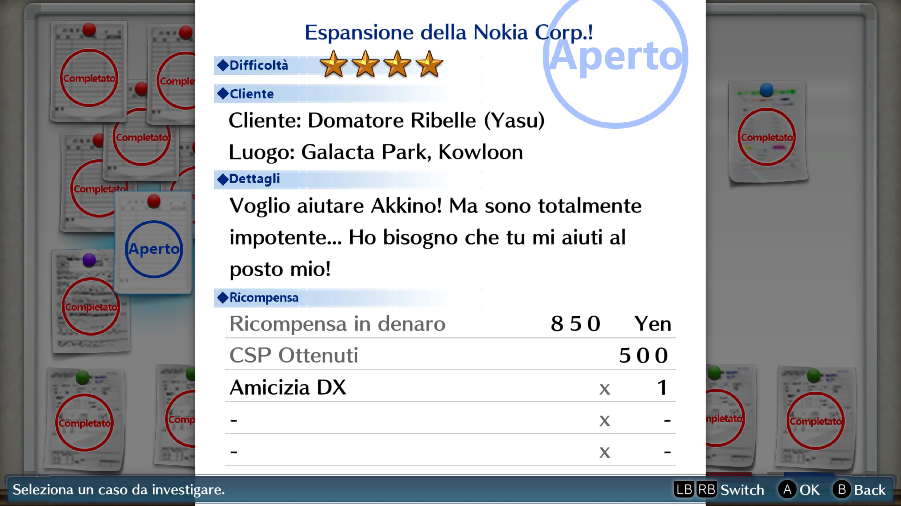
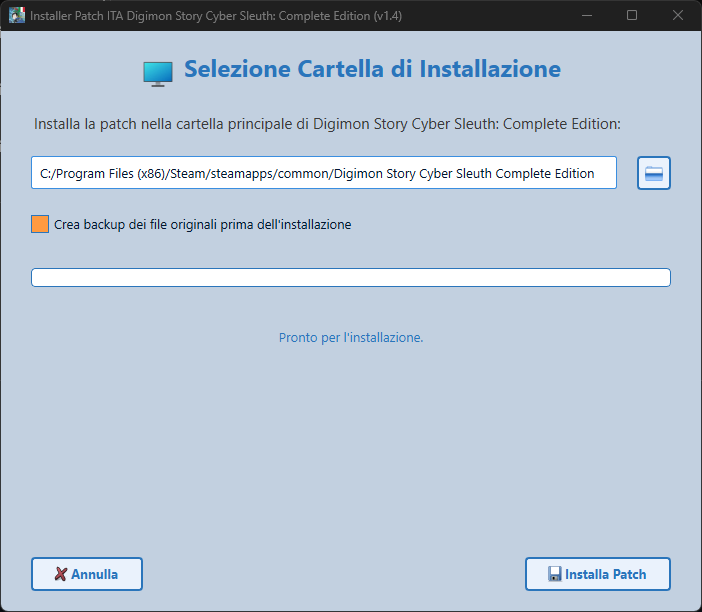
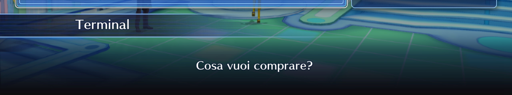

# Digimon Story Cyber Sleuth Patch ITA [](https://www.paypal.com/paypalme/verio12)


La realizzazione della patch è stata resa possibile in larga misura grazie al contributo dell'utente "**Lowrentio**". Egli si è dedicato alla comprensione del funzionamento del tool per la modifica dei file di gioco e all'adattamento delle immagini.

- [Digimon Story Cyber Sleuth Patch ITA ](#digimon-story-cyber-sleuth-patch-ita-)
- [Immagini progetto](#immagini-progetto)
- [Video dimostrativo](#video-dimostrativo)
- [Come installare la patch](#come-installare-la-patch)
- [Come segnalare un errore nella traduzione](#come-segnalare-un-errore-nella-traduzione)
- [Come contribuire nello sviluppo della Patch](#come-contribuire-nello-sviluppo-della-patch)
  - [Mod Loader](#mod-loader)
  - [Struttura file](#struttura-file)
  - [Modifica delle texture](#modifica-delle-texture)
  - [Funzionamento installer (Per chi vuole auto generarsi l'installer)](#funzionamento-installer-per-chi-vuole-auto-generarsi-linstaller)
    - [Requisiti software](#requisiti-software)
  - [Creazione dell'eseguibile](#creazione-delleseguibile)
    - [Windows](#windows)
    - [Linux (Steam Deck)](#linux-steam-deck)
- [Crediti e collaboratori](#crediti-e-collaboratori)

# Immagini progetto




# Video dimostrativo

[![Digimon Story Cyber Sleuth Patch ITA v1.4 [By Lowrentio e SavT]](https://img.youtube.com/vi/tBYz0wpVthk/maxresdefault.jpg)](https://www.youtube.com/watch?v=tBYz0wpVthk)


# Come installare la patch

Per installare la patch, bisogna aprire la sezione [Releases](https://github.com/zSavT/Digimon-Story-Cyber-Sleuth-Patch-ITA/releases) su GitHub e selezionare l'ultima versione della patch disponibile. Selezionate l'installer da scaricare in base al sistema operativo scelto ed avviate l'installer.


L'installer controlla anche la presenza di una nuova versione della patch, in caso affermativo, è possibile scegliere se scaricare la nuova versione o meno.


L'installazione è guidata e semplice, ma in ogni caso basterà sempre cliccare su "_Avanti_". Attendere la verifica dell'integrità dei file della Patch e cliccare successivamente su "_Avanti_".


Successivamente bisogna accettare i termini d'uso e poi nella schermata successiva, selezionare la cartella dove è installato il gioco (Di default è impostato il percorso classico) e cliccare su "_Installa Patch_".



Ora la patch del gioco è installata!

# Come segnalare un errore nella traduzione

Per segnalare errori nella traduzione, bisogna farlo, anche qui, tramite la mia repository su GitHub, tramite la sezione "*issue*" della repo e selezionare il template "**Errori di traduzione**". Successivamente bisogna riportare tutte le informazioni richieste per poter correggere l'errore.
Se il tuo problema è un crash del gioco, puoi creare invece l'issue dedicata al crash del gioco, seguendo sempre le linee guida riportate.


# Come contribuire nello sviluppo della Patch

Oltre a segnalare eventuali problemi nella traduzione della patch, per chi vuole contribuire direttamente nello sviluppo, può forkare la repository, effettuare le modifiche e proporre l'aggiornamento tramite PR (Vedi [qui](https://docs.github.com/en/pull-requests/collaborating-with-pull-requests/working-with-forks/fork-a-repo) per maggiori info sul processo).

## Mod Loader
Il mod loader, oltre a permettere l'installazione delle mod, permette l'estrazione di tutti i file del gioco modificabili. Tutte le info sono indicate nella [guida ufficiale](https://github.com/Pherakki/SimpleDSCSModManager/tree/develop/Documentation) del Tool. 

## Struttura file

I file di testo sono presenti in due cartelle:
- **message**
  - Sono presenti i dialoghi degli NPC, Storia ecc...
- **text**
  - Sono presenti tutte i testi relativi alla descrizione degli oggetti, menu ecc... 

Per quanto riguarda i testi relativi ai box dei dialoghi, esistono due tipologie di box di dialogo:
- "**Completo**"
  - Il box di dialogo occupa tutta la parte inferiore dello schermo.
  - Lunghezza max: 80


- "**Classico**"
  - Questa tipologia di box, non occupa tutto lo schermo e può contenere, leggermente meno caratteri.
  - Lunghezza max: 70 


In generale **non c'è un vero limite di caratteri**, il gioco non esegue nessun controllo, per testi troppo grandi, semplicemente il testo uscirà fuori dallo schermo. 

Altri menu sono:

- **Parole Chiave**
  - la lunghezza **massima è 28 caratteri** per riga. 

- **DigiBook**
  - la lunghezza **massima è 53 caratteri** (54 se inseriamo come ultimo carattere un punto). 

Altri menu di gioco, come per esempio le descrizioni degli oggetti, possono essere visualizzati da interfacce differenti con dimensioni differenti, ma il testo originale è lo stesso, quindi non si può precisare la dimensione massima, in questi casi, si segue la formattazione originale. 

## Modifica delle texture

Le texture del gioco sono presenti nella cartella "**images**". Tutte le immagini sono in formato "**.img**". Per poterle modificare, bisogna modificare l'estensione con "**.dds**" e successivamente utilizzare tool di modifica delle immagini che supportano i DDS (Come [Gimp](https://www.gimp.org/downloads/)). L'esportazione deve avere come formato il DXT5 (BX3).
Per chi utilizza Photoshop, deve installare il [plugin di NVIDIA](https://developer.nvidia.com/texture-tools-exporter) per la gestione dei file DDS.
Dopo aver fatto le modifiche, bisogna salvare sempre in formato DDS e successivamente cambiare l'estensione in IMG.

**NOTA BENE**

Tutte le texture sono specchiate orizzontalmente e ruotate di 180°. L’output finale deve mantenere questo orientamento!. 


## Funzionamento installer (Per chi vuole auto generarsi l'installer)

### Requisiti software

- [Python](https://www.python.org/downloads/) (testato con 3.12)
- Librerie
  - pyzipper
  - PyQt6
  - pyinstaller

Le librerie si possono installare in automatico con il "*requirements.txt*".

```ps
pip install -r requirements.txt
```

## Creazione dell'eseguibile

Per poter creare correttamente l'installer bisogna prima di tutto utilizzare ```packager.py``` per poter generare il file criptato della cartella dove sono presenti tutti i file patchati (Bisogno comunque prima fare un passaggio con il programma "[SimpleDSCSModManager](https://gamebanana.com/tools/8918)"). Lo script è guidato e bisogna solo indicare il percorso della cartella con le modifiche della Patch ed il nome del file pkg criptato. Nel file "chiave.txt" bisogna inserire la chiave di criptazione scelta.

### Windows

Per generare l'eseguibile dell'installer per Windows, bisogna utilizzare il seguente comando:
```ps
pyinstaller --onefile --windowed --hidden-import=webbrowser --hidden-import=pyzipper --hidden-import=sys --hidden-import=os --hidden-import=platform --hidden-import=traceback --hidden-import=PyQt6 --icon=assets/logo.ico --add-data "assets:assets" --add-data "patch.pkg:." --add-data "chiave.txt:." installer.py
```
Nella cartella "_dist_", è presente l'eseguibile.
### Linux (Steam Deck)

Per generare l'eseguibile per Linux, bisogna fare qualche passaggio in più. L'installer è creato tramite la WSL per Windows.
Per prima cosa bisogna creare l'ambiente virtuale per python tramite il comando:
```ps
python3 -m venv venv
```
Se non fosse presente la funzione nell'ambiente, si può installare tramite il seguente comando:
```ps
sudo apt-get install -y python3-venv
```
Con il comando seguente, attiviamo l'ambiente:
```ps
source venv/bin/activate
```
Dopo aver attivato l'ambiente bisogna installare pyinstaller con il comando:
```ps
pip3 install pyinstaller
```
Se pip non è presente nell'ambiente, bisogna installarlo con il comando:
```ps
sudo apt install -y python3-pip
```
Successivamente bisogna installare tutte le librerie utilizzate, presenti nel file requirements.txt, che in ogni caso sono:

- PyQt6
- pyzipper

Successivamente bisogna avviare il comando per la creazione del file eseguibile:
```ps
pyinstaller --onefile --windowed --hidden-import=webbrowser --hidden-import=pyzipper --hidden-import=sys --hidden-import=os --hidden-import=platform --hidden-import=traceback --hidden-import=PyQt6 --icon=assets/logo.png --add-data "assets:assets" --add-data "patch.pkg:." --add-data "chiave.txt:." installer.py
```

Una volta terminato, si può disattivare l'ambiente con il commando:
```ps
deactivate
```
**N.B.**<br>
Il logo dell'eseguibile su linux non è supportato.

Nella cartella "_dist_", è presente l'eseguibile (la versione per Linux non ha tipo/estensione).

# Crediti e collaboratori

- Il principale autore della patch del gioco è l'utente "[Lowrentio](https://steamcommunity.com/id/Lowrentio/)".
- Lo strumento utilizzato per la codifica e decodifica dei file è "[SimpleDSCSModManager](https://gamebanana.com/tools/8918)", realizzato da [Pherakki](https://gamebanana.com/members/2101677).
